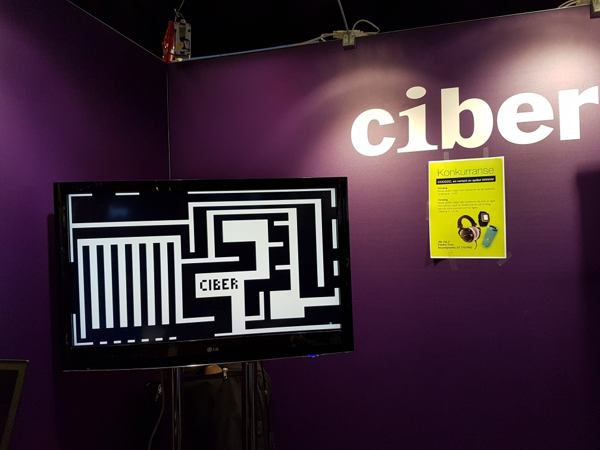

CCCCCC
------

A [VVVVVV](http://thelettervsixtim.es/) clone for Javazone 2016.

## How to play
1. Install Löve2D from https://love2d.org/
2. Clone or download the repo
3. Run `love .` inside the repo
4. Success?

## Leaderboard
The leaderboard is saved in a file called `highscore.txt` in the allowed folder. See [wiki:love.filesystem](https://love2d.org/wiki/love.filesystem) for more. Using the library [SICK](https://love2d.org/wiki/SICK)
- Windows XP: `C:\Documents and Settings\user\Application Data\LOVE\` or `%appdata%\LOVE\`
- Windows Vista and 7: `C:\Users\user\AppData\Roaming\LOVE` or `%appdata%\LOVE\`
- Linux: `$XDG_DATA_HOME/love/` or `~/.local/share/love/`
- Mac: `/Users/user/Library/Application Support/LOVE/`

### Why a clone?
1. Do you ever need an excuse to make a game?
2. Wanted the VVVVVV gameplay on a bigger screen
3. Needed a leaderboard

### What's with the name?
The company I work for is called Ciber...
